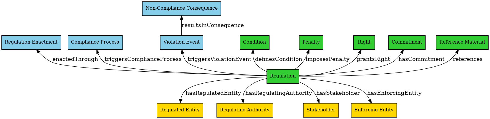

 A lightweight tool - an unofficial demo project - that automatically extracts regulatory knowledge from the NYC Rules website based on a search query. 
 Given a regulation title or keyword, the tool retrieves the related regulation(s), processes its text through AI-powered ontology extraction, and outputs a structured JSON ontology.
 
📌 Example Workflow: 
1️⃣ User inputs a search query (e.g., "Clean Energy Grant Program"). 
2️⃣ The tool scrapes NYC Rules for relevant regulatory texts. 
3️⃣ The AI model extracts entities, processes, and commitments into the defined ontology structure. 
4️⃣ The structured ontology is returned in JSON format, enabling integration with knowledge graphs and compliance systems. 

📌 Regulatory Ontology: 

